# Información del juego

## Nombre del juego
Crab Mail

## Descripcion de la temática del juego 
Crab Mail es un divertido juego cooperativo en el que los jugadores controlan a dos cangrejos que trabajan en una oficina de correos en medio de una playa. Estos deberán preparar sobres y paquetes, pasando por distintos procesos en un tiempo determinado con cuidado de no equivocarse y hacerlo lo más rápido posible.

## Integrantes
- Diego Martínez García. Correo: d.martinezg.2021@alumnos.urjc.es Cuenta de Github: DiegoMartinezGa
- Mario González Mallenco. Correo: m.gonzalezm.2021@alumnos.urjc.es Cuenta de Github: MarioGonzalezM
- Lenin Anderson Carrasco Romero. Correo: la.carrasco.2021@alumnos.urjc.es Cuenta de Github: leniin23
- Alejandro García Martínez. Correo: a.garciamart.2021@alumnos.urjc.es Cuenta de Github: AlejandroGarciaMartinez

# GDD CRAB MAIL
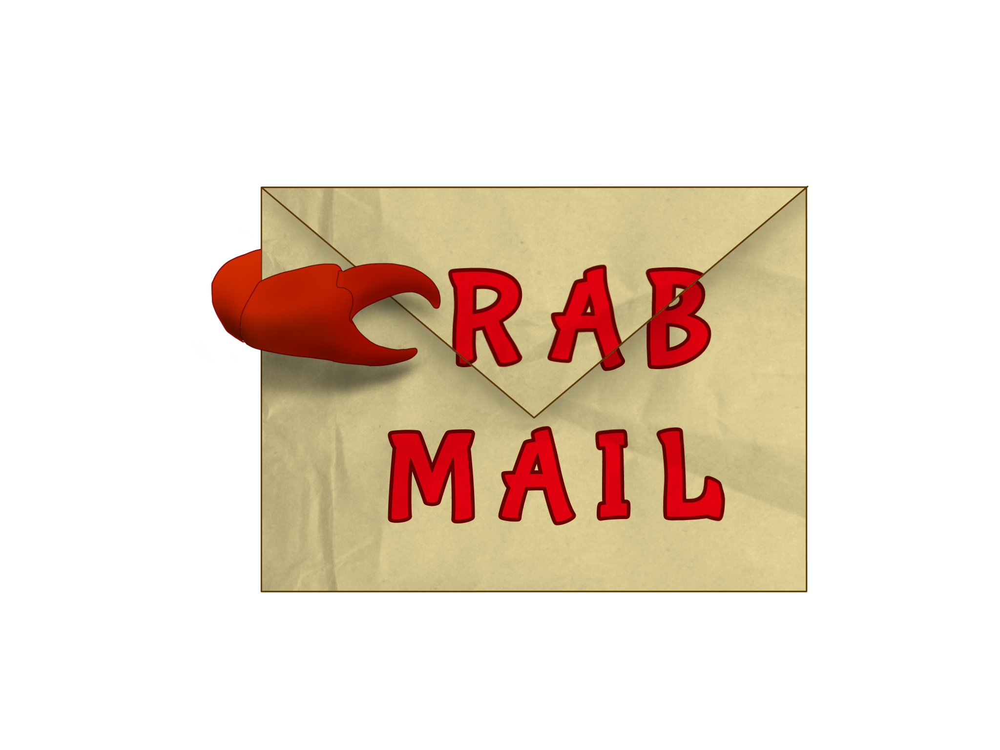
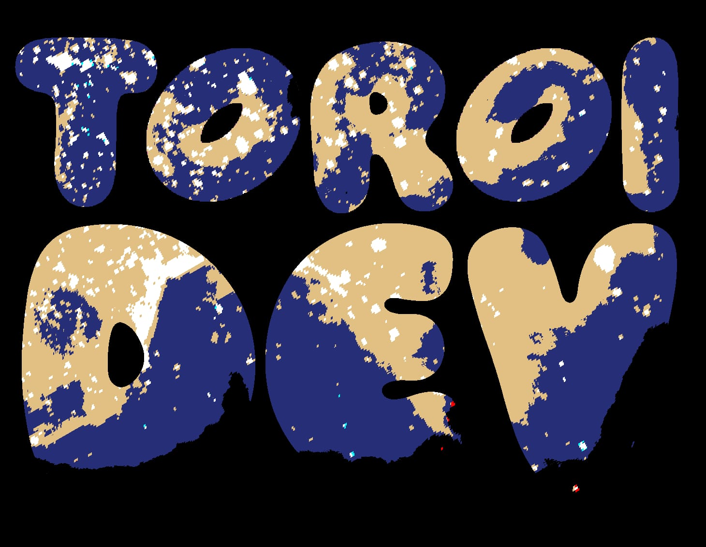

## Juego creado por
- Diego Martínez García
- Mario González Mallenco
- Lenin Anderson Carrasco Romero
- Alejandro García Martínez

## Índice
1. Cambios
2. Introducción
   - 2.1 Concept
   - 2.2 Género
   - 2.3 Propósito y público objetivo
   - 2.4 Jugabilidad
   - 2.5 Estilo visual
   - 2.6 Alcance
3. Mecánicas
   - 3.1 Concept
   - 3.2 Género
   - 3.3 Personajes
   - 3.4 Objetos
   - 3.5 Movimiento e interacción
4. Interfaz
5. Arte y música
   - 5.1 Objetos
   - 5.2 Interfaces
   - 5.3 Personajes
   - 5.4 Música

## 1. Cambios
### Versión 1 
Primera versión del GDD creada. Se han creado distintas secciones para comprender distintos apartados del mismo, así como una descripción general de este junto con su público objetivo y estilo visual, un apartado para las mecánicas del juego y sus controles. Por último, se ha creado un apartado de arte 2D donde están incluidos distintos assets que se han creado para el juego.

## 2. Introducción
### 2.1 Concepto
Crab Mail es un divertido juego cooperativo en el que los jugadores controlan a dos cangrejos que trabajan en una oficina de correos en medio de una playa. Estos deberán preparar sobres y paquetes, pasando por distintos procesos en un tiempo determinado con cuidado de no equivocarse y hacerlo lo más rápido posible.

### 2.2 Género
Este juego combina 2 géneros distintos. Estos son:
  - Lógica: Los juegos de este tipo requieren agilidad mental por parte del jugador para realizar tareas o resolver   enigmas. En Crab Mail, los jugadores deberán trazar planes para conseguir enviar el mayor número de paquetes en el tiempo dado, sin entorpecerse el uno al otro en el camino. El factor cooperativo complica más el asunto, llevando a los jugadores a organizarse y dividirse las tareas para optimizar el tiempo.
    
  - Acción: En los que el jugador debe usar velocidad, destreza y tiempo de reacción. En Crab Mail, los jugadores tendrán que ser rápidos para lograr entregar las comandas antes de que expiren. Además tendrán que adaptarse a los posibles cambios que ocurran en la partida de forma veloz.

### 2.3 Propósito y público objetivo
Crab Mail es un juego diseñado para entretener a los jugadores. Si bien en un principio puede resultar una experiencia caótica por el ritmo de las partidas y el desconocimiento de algunas mecánicas, los jugadores se acabarán ayudando para lograr todos los objetivos, por lo que al final se acaba fomentando la cooperación.

El juego no está dirigido a ninguna sección del público en específico, pueden jugarlo personas de todas las edades. Gracias a que el juego consiste en partidas rápidas, no es necesario disponer de una gran cantidad de tiempo para jugarlo.

### 2.4 Jugabilidad
El juego se basa en rondas rápidas donde los jugadores tienen que tratar de completar el mayor número de envíos posibles en el tiempo dado. Los elementos principales de las rondas son:

  - Movilidad: Los jugadores pueden moverse por la oficina, con cuidado de no chocarse entre ellos, para llegar a los distintos puntos donde se realizan las tareas.

  - Máquinas: Son los lugares donde los jugadores realizan las tareas para poder enviar paquetes y sellos. Están repartidas por el área de juego y solo pueden ser usadas por un jugador a la vez. Algunos ejemplos son el ordenador o la impresora.

### 2.5 Estilo visual
El estilo del juego es en 2D, con el uso de sprites con colores vivos que encajan a la perfección con la estética animada del juego. Cabe destacar que será un estilo visual simple, sin gran cantidad de detalles, como por ejemplo, sombreados leves.

### 2.6 Alcance
Al ser un juego que consiste en rondas cortas, se pueden ampliar la cantidad de mapas jugables, con diferentes disposiciones de las máquinas en ellos.

## 3. Mecánicas
Las mecánicas del juego son muy sencillas, incluyendo teclas para el movimiento de los personajes y un par de botones para interactuar con los diversos objetos. La clave radica en la forma de interactuar con estos, pues aunque haya solo un par de botones se pueden incluir diversas mecánicas, como por ejemplo, darle muchas veces a una tecla para completar una tarea.

### 3.1 Jugabilidad
El juego consiste en partidas cronometradas donde los jugadores tienen que completar el mayor número de tareas en el tiempo dado. Cada tarea tiene a su vez un límite de tiempo para poder ser realizada, antes de que el cliente la cancele y los jugadores pierdan puntos.

Podemos encontrar 2 tipos de pedidos: paquetes y cartas. Cada uno de ellos deben pasar por una serie de máquinas y procesos antes de ser depositados en los buzones de envío. 

Si el pedido se entrega a tiempo y en las condiciones correctas, se otorgan puntos a los jugadores. En caso contrario, se les restará puntos. 

Al final de la partida se obtiene una puntuación total para los dos jugadores, así como otras estadísticas, como el número de pedidos completados con éxito y los que se han fallado.

### 3.2 Flujo de juego
El flujo del juego es el siguiente:

Al empezar la partida, comienzan a aparecer distintos objetos en la cinta de transporte. Estos pueden ser de 2 tipos:

  - Portapapeles: Indica que hay que preparar una carta.
  - Objeto: Indica que hay que preparar un paquete con ese objeto.

Una vez se hayan preparado los pedidos, se deben llevar a su buzón correspondiente antes de que se acabe el plazo para obtener puntuación positiva.

Cada pedido tiene su método de preparación distinto, es decir, antes de ser enviado debe pasar por máquinas distintas.

En el caso de las cartas, primero se debe imprimir el papel en la impresora, luego meterlo en un sobre, introducir su dirección con el ordenador, y añadirle el sobre correspondiente a las cartas. Por último se debe introducir en el buzón de las cartas.

Para preparar los paquetes, primero se debe coger el objeto de la cinta transportadora, meterlo en una caja de cartón, meter su dirección en el ordenador, pesar el paquete en la báscula y poner un sello de acuerdo a su peso. Para completar el envío, se debe introducir el paquete en el buzón de paquetes.

### 3.3 Personajes
Los jugadores controlarán a un cangrejo que tendrá un aspecto por defecto, siendo el jugador uno un cangrejo de color rojo, y el jugador dos uno más anaranjado, con el objetivo de que los jugadores puedan diferenciarlos durante el juego.

Se baraja la opción de incluir un sistema de personalización para los cangrejos, donde se les puedan cambiar aspectos como el color o añadir elementos cosméticos.

### 3.4 Objetos
En el juego los objetos que se pueden encontrar coinciden con las principales mecánicas del juego, las máquinas que se deben usar para preparar los pedidos a entregar.

  - Impresora: Sirve para imprimir las cartas. Una vez que se interactúa con ella, se activa un pequeño temporizador. Al terminar esta cuenta atrás, la carta se imprime.

  - Caja de sobres: Los jugadores interactúan con esta caja para meter el papel impreso en el sobre.

  - Ordenador: Los jugadores interactúan con una carta o paquete para añadir la dirección. Para ello, el jugador debe pulsar el botón de interacción múltiples veces. Esta máquina solo puede ser usada por un jugador a la vez.

  - Estación de empaquetado: En esta máquina, los jugadores pueden introducir los objetos para que sean empaquetados. Tiene un pequeño temporizador que acaba cuando el objeto sale empaquetado de la máquina.

  - Báscula: El jugador debe interactuar con la báscula con un paquete en mano, con el objetivo de pesarlo y saber qué sello debe colocarle a continuación.

  - Mesa de sellos: En esta mesa los jugadores deben poner un sello a los sobres y a los paquetes. En total hay 4 sellos: sellos para las cartas, sellos para paquetes con un peso menor a 25 kg, entre 25 y 50 kg y entre 50 y 70 kg.

  - Estación de reinicio: En este lugar, los jugadores pueden devolver el pedido a su estado original en caso de equivocación en alguna parte del proceso. En el caso de las cartas, devuelve el papel impreso; y en el caso de los paquetes devuelve el objeto desempaquetado.

  - Buzones de envío: En este lugar hay dos buzones, uno para las cartas y otro para los paquetes. Aquí es donde los jugadores deben llevar los pedidos una vez hayan acabado de prepararlos para obtener puntos.

  - Papelera: Los jugadores podrán desechar los pedidos aquí en caso de que no consigan preparar el pedido a tiempo.

### 3.5 Movimiento e interaccion
El movimiento de los cangrejos no es el movimiento tradicional en cuatro direcciones, sino que el cangrejo solo podrá avanzar hacia delante. Para cambiar la dirección, el jugador tendrá que rotar el cangrejo a la izquierda o a la derecha. 

Además, hay un botón para interactuar con los diferentes objetos y poder completar las tareas. 

De este modo, el movimiento del jugador 1 será W para avanzar, A para rotar a la izquierda y D para rotar a la derecha. El jugador 2 usará la flecha hacia arriba para avanzar, y las flechas hacia izquierda y derecha para rotar. El botón de interacción para el jugador 1 será la E, y para el jugador 2 la tecla 0 en el teclado numérico.

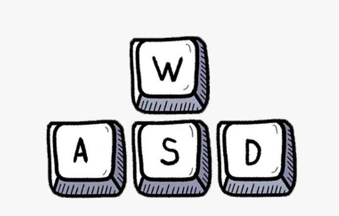 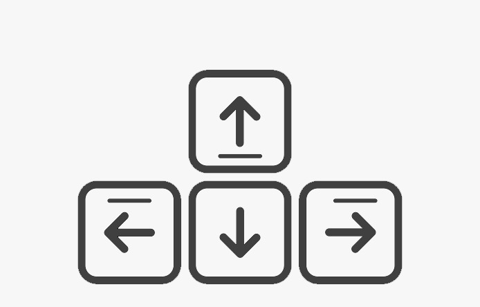

## 4. Interfaz
Debido al amplio rango de edades, las interfaces serán sencillas. Para ampliar la inmersión, estas estarán extensivamente tematizadas. 

Sin embargo, al ser un juego sencillo, solo va a precisar de las siguientes interfaces:

  - Menú principal: Contiene la pantalla de título y las opciones de comenzar una partida local o una partida en red (ambas llevan al menú de selección). También permite acceder al menú de opciones y al menú de controles.

  - Selección de personajes: Permite comenzar una partida y volver al menú principal. La única diferencia entre online y local es que en la primera sólo existe la opción de elegir un personaje.

  - Menú de pausa: Tiene las opciones de continuar el juego y acceder al menú de ajustes. 

  - Menú de ajustes: Permite configurar ciertos parámetros, como el volumen de la música o de los efectos de sonido. Se puede salir al menú anterior.

  - Menú de controles: Explica los controles, se puede salir al menú anterior.

## 5. Arte y música
A continuación se muestran referencias visuales del juego, como los diseños creados tanto de los cangrejos que controlan los jugadores, escenario donde se desarrollan las partidas y objetos con los que se interactúa.

### 5.1 Objetos
Impresora: 

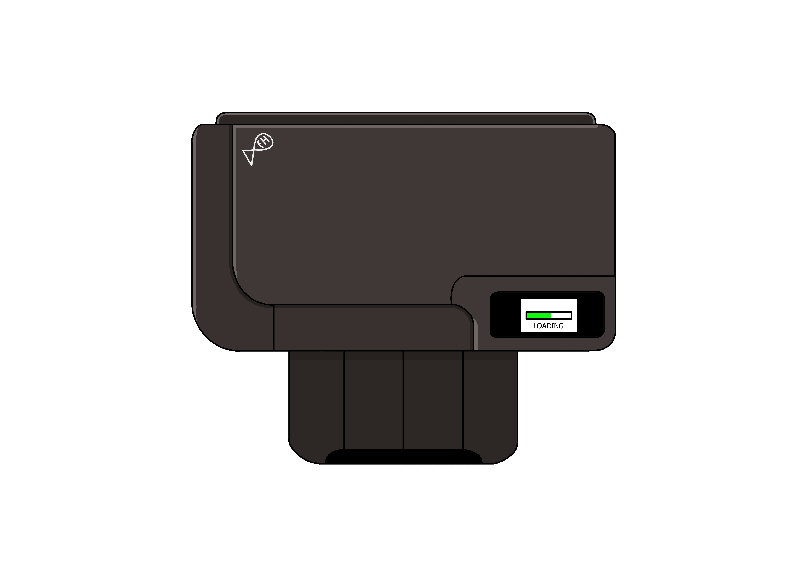

Báscula: 

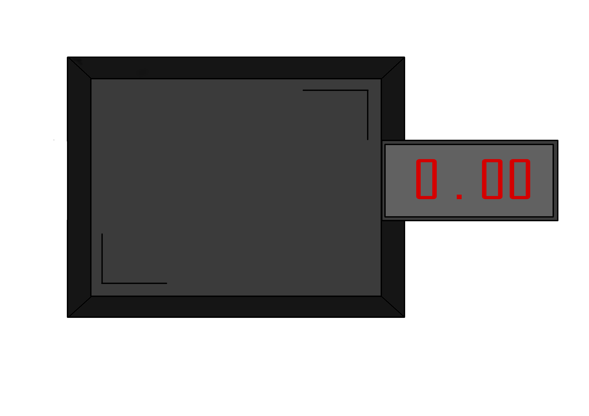

Buzon de sobres: 

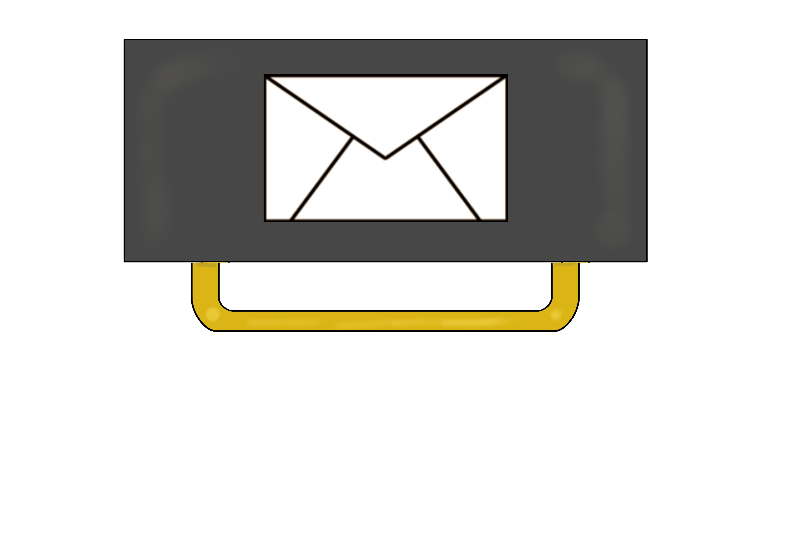

Caja de sobres:

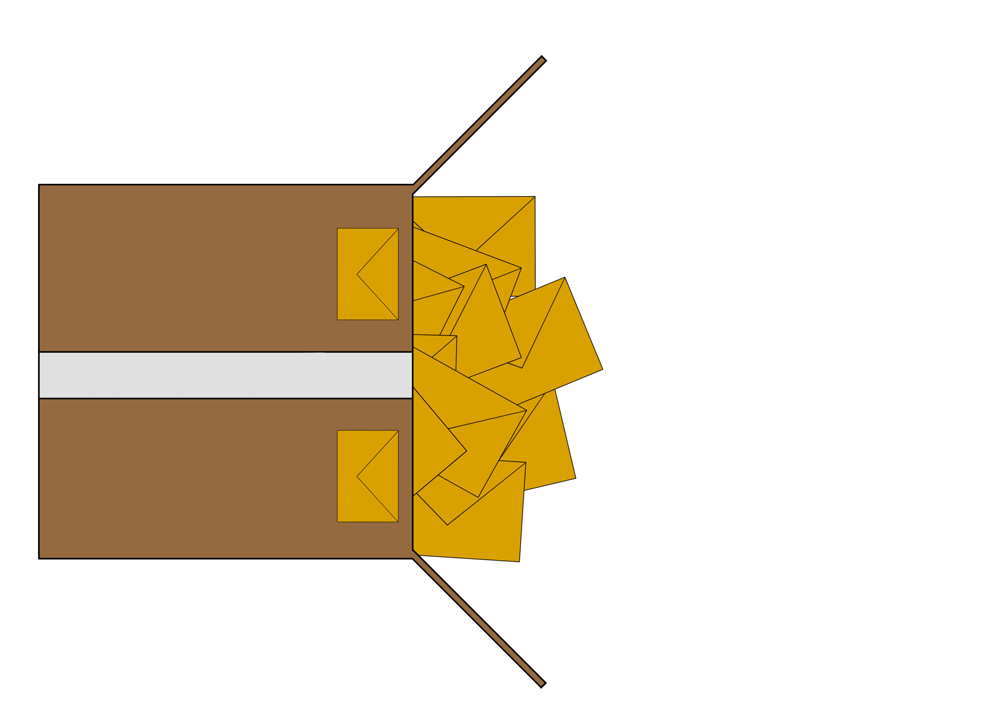

Ordenador: 

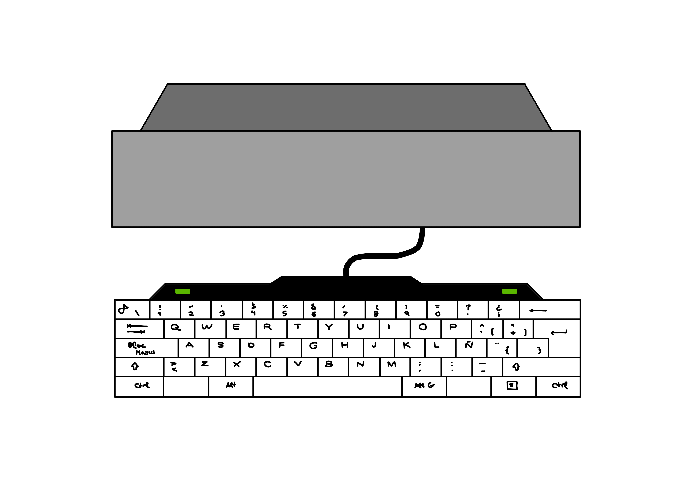

Mesa de sellos: 

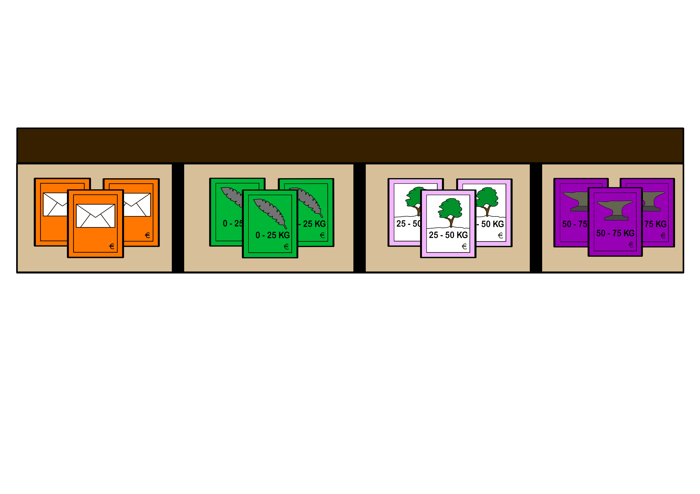

### 5.2 Interfaces
Menú principal: 

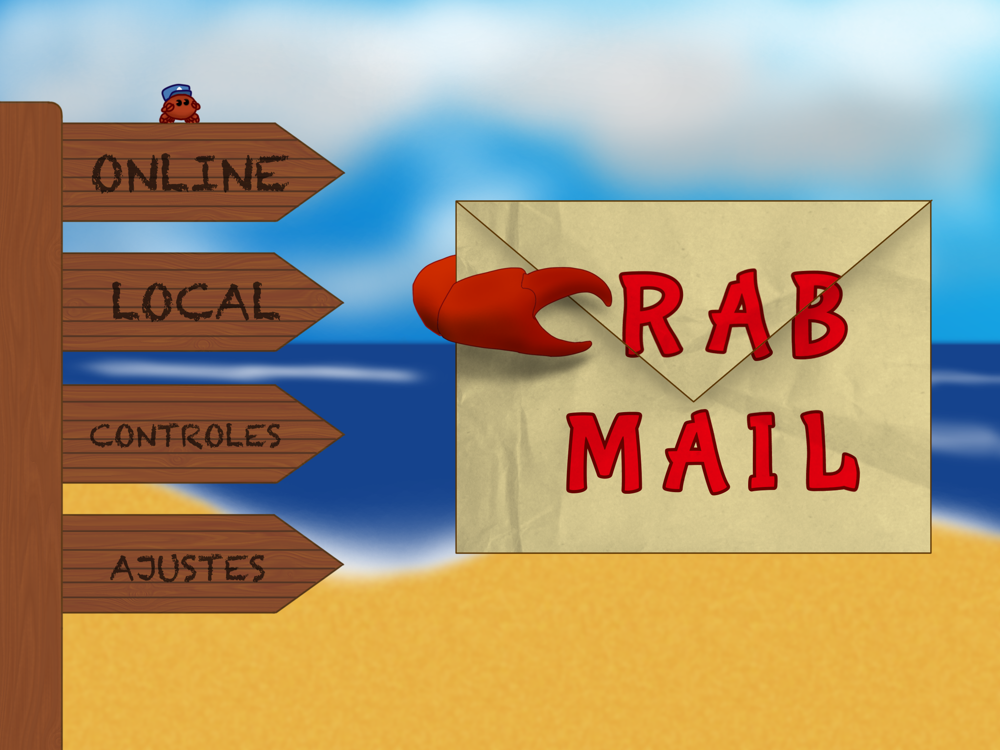

Menú de pausa: 

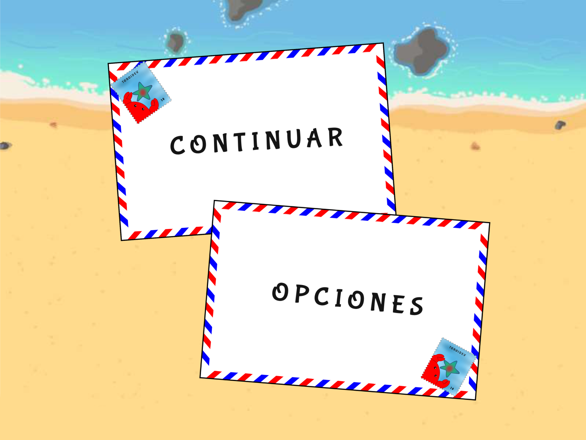

Fondo de juego: 

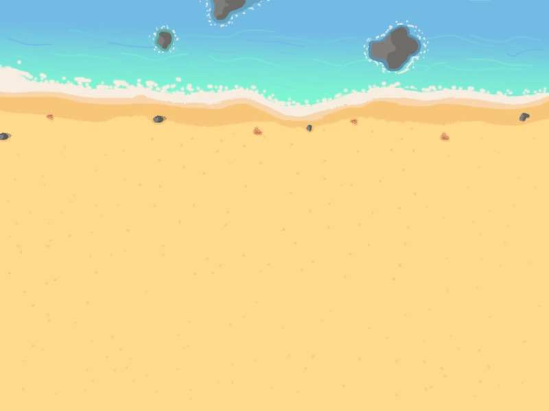

### 5.3 Personajes
Sprites del jugador 1: 

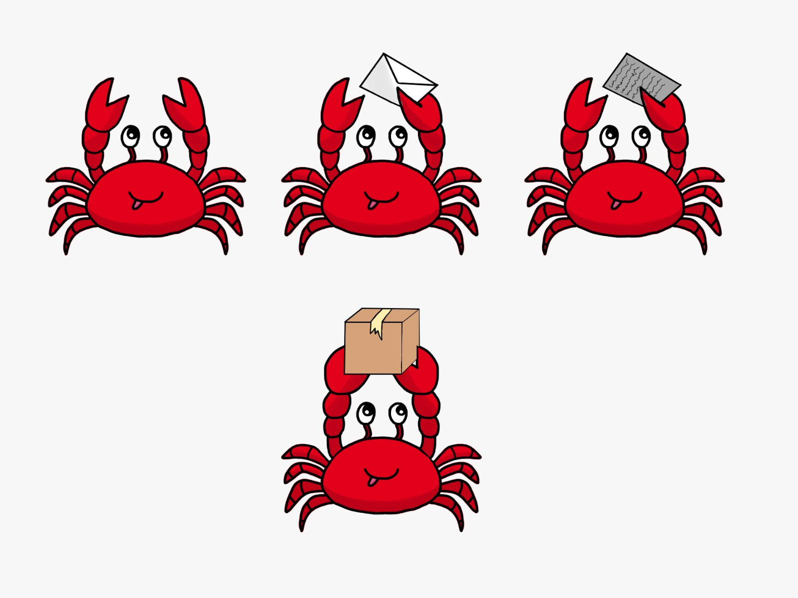

Sprites del jugador 2: 

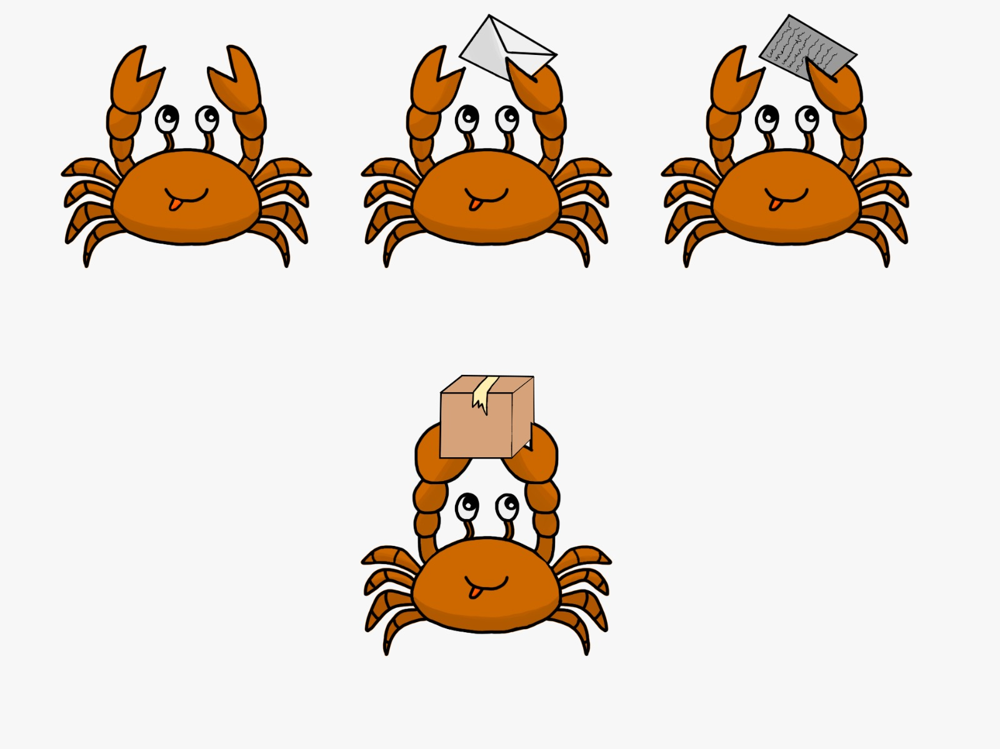

### 5.4 Música
Para que encaje con la temática del juego, queremos implementar una música alegre, pero suave.

La música implementa instrumentos que evocan el verano, como el ukelele, y un instrumento de percusión que emule el chasquido de las pinzas de cangrejos.

Además, se incluirán sonidos al interactuar con los distintos objetos del juego, como la impresora, la cinta…incluyendo también sonidos al ganar o perder puntos cuando completas una tarea.
