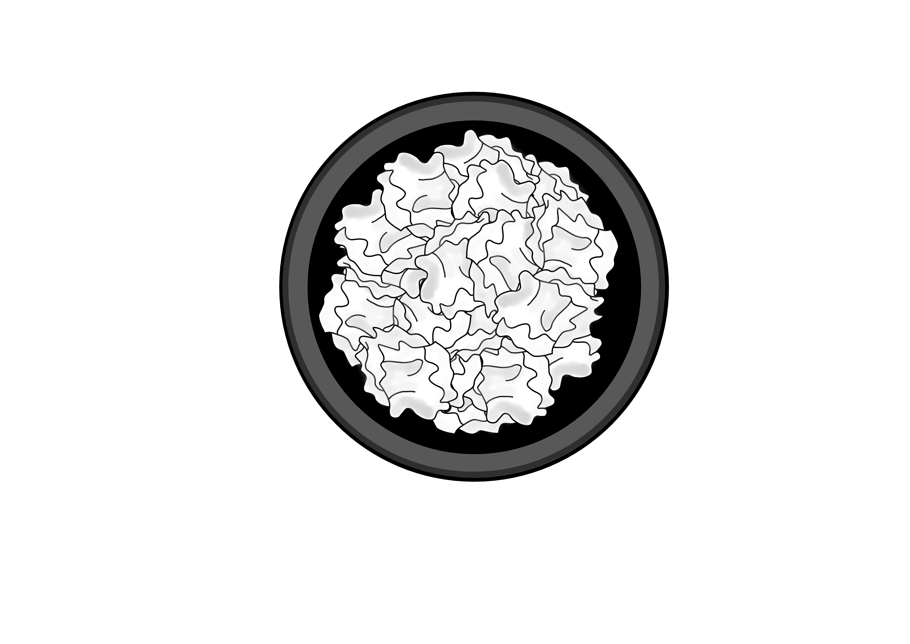
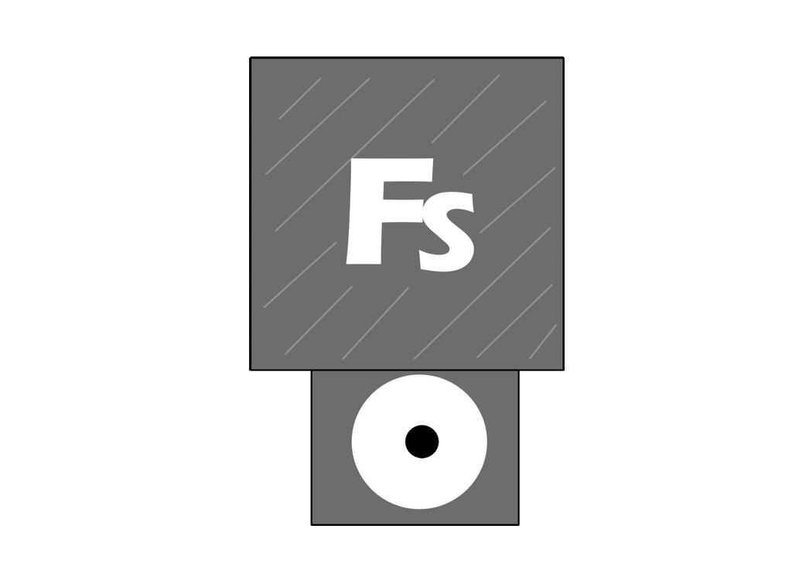
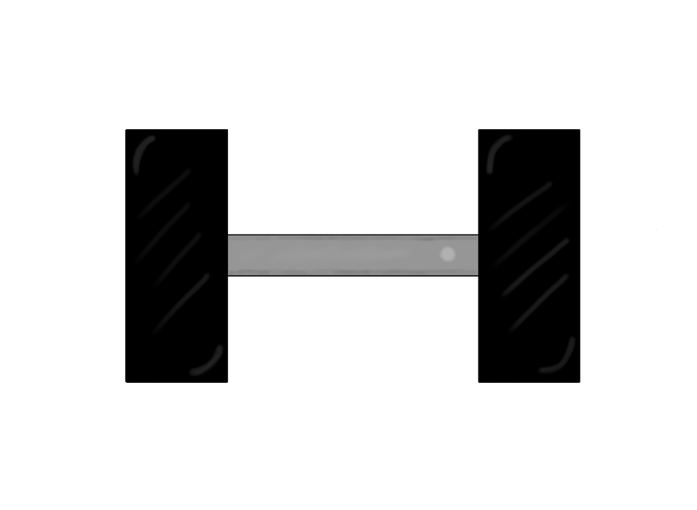
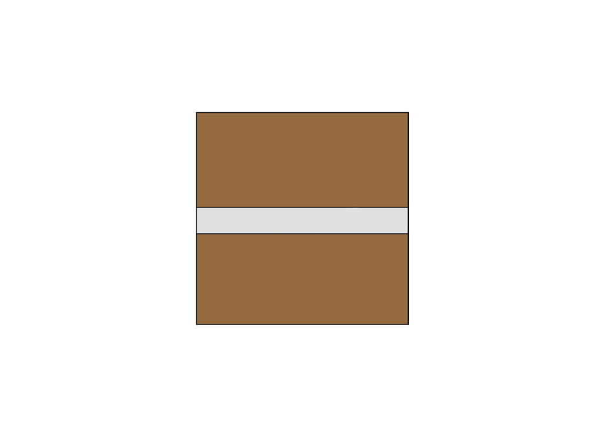
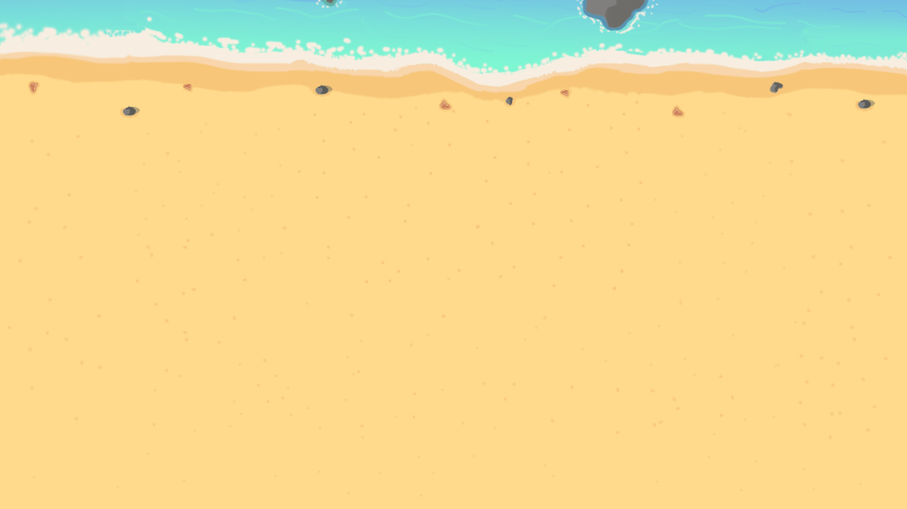

# Información del juego

## Nombre del juego
Crab Mail

## Descripcion de la temática del juego 
Crab Mail es un divertido juego cooperativo en el que los jugadores controlan a dos cangrejos que trabajan en una oficina de correos en medio de una playa. Estos deberán preparar sobres y paquetes, pasando por distintos procesos en un tiempo determinado con cuidado de no equivocarse y hacerlo lo más rápido posible.

## Integrantes
- Diego Martínez García. Correo: d.martinezg.2021@alumnos.urjc.es Cuenta de Github: DiegoMartinezGa
- Mario González Mallenco. Correo: m.gonzalezm.2021@alumnos.urjc.es Cuenta de Github: MarioGonzalezM
- Lenin Anderson Carrasco Romero. Correo: la.carrasco.2021@alumnos.urjc.es Cuenta de Github: leniin23
- Alejandro García Martínez. Correo: a.garciamart.2021@alumnos.urjc.es Cuenta de Github: AlejandroGarciaMartinez

# GDD CRAB MAIL

## Juego creado por
- Diego Martínez García
- Mario González Mallenco
- Lenin Anderson Carrasco Romero
- Alejandro García Martínez

## Índice
1. Cambios
2. Introducción
   - 2.1 Concept
   - 2.2 Género
   - 2.3 Propósito y público objetivo
   - 2.4 Jugabilidad
   - 2.5 Estilo visual
   - 2.6 Alcance
3. Mecánicas
   - 3.1 Concept
   - 3.2 Género
   - 3.3 Personajes
   - 3.4 Objetos
   - 3.5 Movimiento e interacción
4. Interfaz
5. Arte y música
   - 5.1 Objetos
   - 5.2 Interfaces
   - 5.3 Personajes
   - 5.4 Música

## 1. Cambios
### Versión 1 
Primera versión del GDD creada. Se han creado distintas secciones para comprender distintos apartados del mismo, así como una descripción general de este junto con su público objetivo y estilo visual, un apartado para las mecánicas del juego y sus controles. Por último, se ha creado un apartado de arte 2D donde están incluidos distintos assets que se han creado para el juego.

### Versión 2
Se ha añadido todo lo relacionado con la creacion del juego una vez desarrollado este, como sprites, descripcion de la música creada, menus, asi como algunos aspectos que no se introdujeron en la primera version del GDD como la historia del juego, las plataformas para las que esta desarrollado, inspiraciones y flujograma. Por último, se han modificado algunos de los sprites de la primera version para introducir su version definitiva

## 2. Introducción
### 2.1 Concepto
Crab Mail es un divertido juego cooperativo en el que los jugadores controlan a dos cangrejos que trabajan en una oficina de correos en medio de una playa. Estos deberán preparar sobres y paquetes, pasando por distintos procesos en un tiempo determinado con cuidado de no equivocarse y hacerlo lo más rápido posible.

### 2.2 Género
Este juego combina 2 géneros distintos. Estos son:
  - Lógica: Los juegos de este tipo requieren agilidad mental por parte del jugador para realizar tareas o resolver   enigmas. En Crab Mail, los jugadores deberán trazar planes para conseguir enviar el mayor número de paquetes en el tiempo dado, sin entorpecerse el uno al otro en el camino. El factor cooperativo complica más el asunto, llevando a los jugadores a organizarse y dividirse las tareas para optimizar el tiempo.
    
  - Acción: En los que el jugador debe usar velocidad, destreza y tiempo de reacción. En Crab Mail, los jugadores tendrán que ser rápidos para lograr entregar las comandas antes de que expiren. Además tendrán que adaptarse a los posibles cambios que ocurran en la partida de forma veloz.

### 2.3 Inspiración y referencias
El juego está inspirado en otros juegos cooperativos como la saga Overcooked, donde los jugadores deben cooperar para preparar platos de comida; y Keywe, donde el juego se basa en preparar pedidos.

Para la estructura del GDD se ha tomado como referencia el GDD de Sion Tower (https://github.com/dsaltares/sion-tower/blob/master/doc/gdd/gdd.pdf).

### 2.3 Propósito y público objetivo
Crab Mail es un juego diseñado para entretener a los jugadores. Si bien en un principio puede resultar una experiencia caótica por el ritmo de las partidas y el desconocimiento de algunas mecánicas, los jugadores se acabarán ayudando para lograr todos los objetivos, por lo que al final se acaba fomentando la cooperación.

El juego no está dirigido a ninguna sección del público en específico, pueden jugarlo personas de todas las edades. Gracias a que el juego consiste en partidas rápidas, no es necesario disponer de una gran cantidad de tiempo para jugarlo.

### 2.3 Historia del juego
Carb Mail es un juego que no tiene una fuerte componente narrativa, ya que su gameplay se basa en rondas independientes que no tienen ninguna relacion entre si y no cuentan una historia.

Sin embargo se ha creado un pequeño trasfondo para el juego que se tiene pensado incluir en el juego en forma de introduccion o cinemática.

La historia del juego comienza con un accidente de un avión en una playa de una isla desierta. Este avión contenia máquinas y articulos de ofimática, que fueron a parar a la costa. Con el paso del tiempo, los cangrejos que habitaban la playa aprendieron a usarlos y los utilizaron para crear una oficina en la que poder crear y enviar cartas y paquetes a distintos sitios del mundo. Por ello, en este juego se controla a 2 empleados de la oficina, que tienen que completar el mayor numero de pedidos posibles en lo que dura su turno si no quieren ser despedidos

### 2.4 Plataformas
El juego está siendo desarrollado para PC pudiendose jugar en un navegador web con teclado. Sin embargo, se está estudianto la posibilidad de incluir compatibilidad con mando.

### 2.5 Jugabilidad
El juego se basa en rondas rápidas donde los jugadores tienen que tratar de completar el mayor número de envíos posibles en el tiempo dado. Los elementos principales de las rondas son:

  - Movilidad: Los jugadores pueden moverse por la oficina, con cuidado de no chocarse entre ellos, para llegar a los distintos puntos donde se realizan las tareas.

  - Máquinas: Son los lugares donde los jugadores realizan las tareas para poder enviar paquetes y sellos. Están repartidas por el área de juego y solo pueden ser usadas por un jugador a la vez. Algunos ejemplos son el ordenador o la impresora.

### 2.6 Estilo visual
El estilo del juego es en 2D, con el uso de sprites con colores vivos que encajan a la perfección con la estética animada del juego. Cabe destacar que será un estilo visual simple, sin gran cantidad de detalles, como por ejemplo, sombreados leves.

### 2.7 Alcance
Al ser un juego que consiste en rondas cortas, se pueden ampliar la cantidad de mapas jugables, con diferentes disposiciones de las máquinas en ellos. Además, se pretende ampliar los distintos objetos que salen de la cinta, para dar mas variedad al juego.

## 3. Mecánicas
Las mecánicas del juego son muy sencillas, incluyendo teclas para el movimiento de los personajes y un par de botones para interactuar con los diversos objetos.

### 3.1 Jugabilidad
El juego consiste en partidas cronometradas donde los jugadores tienen que completar el mayor número de tareas en el tiempo dado. Cada tarea tiene a su vez un límite de tiempo para poder ser realizada, antes de que el cliente la cancele y los jugadores pierdan puntos.

Podemos encontrar 2 tipos de pedidos: paquetes y cartas. Cada uno de ellos deben pasar por una serie de máquinas y procesos antes de ser depositados en los buzones de envío. 

Una vez entregado el pedido, se otorgará una puntuacion que depende de si se ha seguido el proceso correcto a la hora de preparar los pedidos o ha faltado algo

Al final de la partida se obtiene una puntuación total para los dos jugadores según la cantidad de pedidos preparados.

### 3.2 Flujo de juego
El flujo del juego es el siguiente:

Al empezar la partida, comienzan a aparecer distintos objetos en la cinta de transporte. Estos pueden ser de 2 tipos:

  - Papel: Indica que hay que preparar una carta.
  - Objeto: Indica que hay que preparar un paquete con ese objeto.

Una vez se hayan preparado los pedidos, se deben llevar a su buzón correspondiente antes de que se acabe el plazo para obtener puntuación positiva.

Cada pedido tiene su método de preparación distinto, es decir, antes de ser enviado debe pasar por máquinas distintas.

En el caso de las cartas, primero se debe llevar el papel a la imoresora para rellenar la informacion, luego meterlo en un sobre, introducir su dirección con el ordenador, y añadirle el sello correspondiente a las cartas. Por último se debe introducir en el buzón de las cartas.

Para preparar los paquetes, primero se debe coger el objeto de la cinta transportadora, llevarlo a la estacion de empaquetado, meter su dirección en el ordenador, pesar el paquete en la báscula y poner un sello de acuerdo a su peso. Para completar el envío, se debe introducir el paquete en el buzón de paquetes.

### 3.3 Personajes
Los jugadores controlarán a un cangrejo que tendrá un aspecto por defecto, siendo el jugador uno un cangrejo de color rojo, y el jugador dos uno más anaranjado, con el objetivo de que los jugadores puedan diferenciarlos durante el juego.

Se baraja la opción de incluir un sistema de personalización para los cangrejos, donde se les puedan cambiar aspectos como el color o añadir elementos cosméticos.

### 3.4 Objetos
En el juego los objetos que se pueden encontrar coinciden con las principales mecánicas del juego, las máquinas que se deben usar para preparar los pedidos a entregar. Además, algunos objetos tienen varios sprites que se activan dependiendo de en que estado se encuentre la maquina, como por ejemplo la impresora que en un principio aparece vacia y cuando acaba de imprimir muestra un sprite con el papel.

  - Impresora: Sirve para rellenar las cartas. Una vez que se interactúa con ella, se activa un pequeño temporizador. Al terminar esta cuenta atrás, la carta sale de la impresora rellena. Hay que volver a interactuar con la impresora para recogerla

  - Caja de sobres: Los jugadores interactúan con esta caja para meter el papel impreso en el sobre.

  - Ordenador: Los jugadores interactúan con una carta o paquete para añadir la dirección. Es necesario que el pedido se encuentre en un sobre o un paquete para poder usarla.

  - Estación de empaquetado: En esta máquina, los jugadores pueden introducir los objetos para que sean empaquetados. Tiene un pequeño temporizador que acaba cuando el objeto sale empaquetado de la máquina.

  - Báscula: El jugador debe interactuar con la báscula con un paquete en mano, con el objetivo de pesarlo y saber qué sello debe colocarle a continuación. En la primera interaccion se coloca el objeto en la bascula y aparece el peso en una pequeña pantalla a la derecha, y en la segunda interaccion se recoge el objeto de nuevo. Esta máquina se puede usar tanto si el objeto ha sido empaquetado como si no.

  - Mesa de sellos: En esta mesa los jugadores deben poner un sello a los sobres y a los paquetes. En total hay 4 sellos: sellos para las cartas, sellos para paquetes con un peso menor a 5 kg, entre 5 y 10 kg y mas de 10 kg

  - Estación de reciclado: En este lugar, los jugadores pueden devolver el pedido a su estado original en caso de equivocación en alguna parte del proceso. En el caso de las cartas, devuelve el papel sin imprimir; y en el caso de los paquetes devuelve el objeto desempaquetado.

  - Buzones de envío: En este lugar hay dos buzones, uno para las cartas y otro para los paquetes. Aquí es donde los jugadores deben llevar los pedidos una vez hayan acabado de prepararlos para obtener puntos.

  - Papelera: Los jugadores podrán desechar los pedidos aquí en caso de que no consigan preparar el pedido a tiempo.

  - Cinta: En esta máquina aparecen todas los objetos y cartas que los jugadores pueden coger para preparar los pedidos. Pueden salir tanto objetos de diferentes tamaños y pesos, como papel para las cartas.

  - Mesas: Se han colocado mesas a lo largo y ancho de todo el mapa. Estas tienen 2 objetivos: servir como limites del escenario del juego así como crear un entramado gracias a las mesas centrales. Estas mesas crean un espacio que contiene tanto el ordenador como la báscula y al no ser un espacio muy amplio, puede provocar choques entre los jugadores, aumentando el caos en la partida
    
### 3.5 Movimiento e interaccion
El movimiento de los cangrejos no es el movimiento tradicional en cuatro direcciones, sino que el cangrejo solo podrá avanzar hacia delante. Para cambiar la dirección, el jugador tendrá que rotar el cangrejo a la izquierda o a la derecha. 

Además, hay un botón para interactuar con los diferentes objetos y poder completar las tareas. Cuando un jugador interactua con un objeto, el cangrejo lo y de este modo puede llevarlo a donde necesite, ya sea un objeto que se necesite meter en un paquete o un papel que se tenga que llevar a la impresora. Además, para llevar un objeto de una máquina a otra el jugador puede interaccionar con este y oger el objeto para llevarlo a donde necesite.

De este modo, el movimiento del jugador 1 será W para avanzar, A para rotar a la izquierda y D para rotar a la derecha. El jugador 2 usará la flecha hacia arriba para avanzar, y las flechas hacia izquierda y derecha para rotar. El botón de interacción para el jugador 1 será la E, y para el jugador 2 la tecla 0 en el teclado numérico.

Además, las maquinas solo pueden ser utilizadas por un jugador a la vez y las maquinas que tienen un temporizador como la impresora y la estación de empaquetado no se pueden utilizar si estan funcionando.

## 4. Interfaz
Debido al amplio rango de edades, las interfaces serán sencillas. Para ampliar la inmersión, estas estarán extensivamente tematizadas. 

Sin embargo, al ser un juego sencillo, solo va a precisar de las siguientes interfaces:

  - Menú principal: Contiene la pantalla de título y las opciones de comenzar una partida local o una partida en red. También permite acceder al menú de opciones y al menú de controles. La opcion de partida local hace que el juego comience.
   
  - Menú de pausa: Tiene las opciones de continuar el juego y acceder al menú de ajustes. 

  - Menú de ajustes: Permite configurar ciertos parámetros, como el volumen de la música o de los efectos de sonido. Se puede salir al menú anterior.

  - Menú de controles: Explica los controles, se puede salir al menú anterior.
    
  - Menu de juego online: Debido a que todavia no se ha implementado el juego online esta pantalla se trata de una pantalla en la que pone un cartel de "en construccion".

  - Menu de fin de partida: Una vez que se ha terminado la partida se accede a esta pantalla donde se muestra la puntuación que se ha obtenido en la partida, asi como dar la opción de volver al menú principal para volver a jugar otra partida e intentar lograr una mejor puntuación.

Por último, se ha creado un flujograma que muestra el flujo de las distintas pantallas que se muestran en el juego.

## 5. Arte y música
En cuanto al arte del juego, todo es de elaboración propia usando programas como Photoshop y Krita. Además, también se ha creado la musica que aparece en el menu del juego y en las partidas usando un programa de creación de musica

### 5.1 Maquinas
Aqui se puede ver el arte de todas las máquinas que se pueden encontrar en el escenario de juego y con las cuales el jugador debe interactuar

Impresora: 

Báscula: 

Buzon de cartas: 

Buzon de paquetes: 

Caja de sobres:

Ordenador: 

Mesa de sellos: 

Estacion de empaquetado:

Cinta:

Papelera:

Estación de reciclado:

Mesa:

Mesa central:

### 5.2 Objetos
Se han diseñado distintos objetos que aparecen en la cinta, como una consola, un juego, un peluche. Ademas de los papeles que indican al jugador que debe preparar una carta

Consola:

Videojuego:

Mancuerna:

Peluche:

Yunque:

Papel:

### 5.3 Cartas y paquetes
Tambien se han creado distintos sprites que representan el estado de la carta y el paquete llevado por el jugador. Por ello encontramos un sprite de la carta/paquete sin nada, la carta/paquete con el sello o la direccion y la carta/paquete con ambas cosas.

Carta sin nada:

Carta con sello:

Carta con direccion:

Carta con sello y direccion:

Paquete sin nada:

Paquete con sello:

Paquete con direccion:

Paquete con sello y direccion:

### 5.2 Interfaces
Menú principal: 

Menú de pausa: 

Fondo de juego: 

Menu final:

Menu de configuracion:

Menu "en construccion":

### 5.3 Personajes
Para los personajes, se han creado spritesheets para la implementacion de la animacion de los personajes caminando.

Sprites del jugador 1: 

Sprites del jugador 2: 

### 5.4 Música
Debido al ambiente alegre del juego, se ha creado una musica alegre que evoque el verano. Pero, al tratarse de un juego con un componente caótico la musica tiene un ritmo que provoca un poco de presion en los jugadores. 

Además, la musica de fondo tiene 2 versiones, una para los 2 primeros minutos de la partida, y otra para el último minuto, la cual es una version acelerada de la musica del fondo creada para provocar una mayor tensión en los jugadores y aumentar el factor caos.  También se han introducido musica de fondo en el menú principal así como sonidos cuando pulsas los botones del menu.

Para crear la musica, se ha utilizado musescore 4. En él, se han usado instrumentos como el piano y la flauta acompañados de percusion para dar ritmo a la canción. Para la version rápida de la música que se usa en las partidas, se ha añadido un bombo para dar más presión a los jugadores y provocar una sensacion de caos en los ultimos momentos de la partida.

También se han incluido sonidos que se reproducen al interactuar con las distintas máquinas del juego, como la impresora, la estacion de empaquetado o el ordenador; ademas de cuando completas un pedido.
Si bien la musica ha sido creada por nosotros, los sonidos de las maquinas se han obtenido de una librería de sonidos en internet  (https://pixabay.com/es/)
