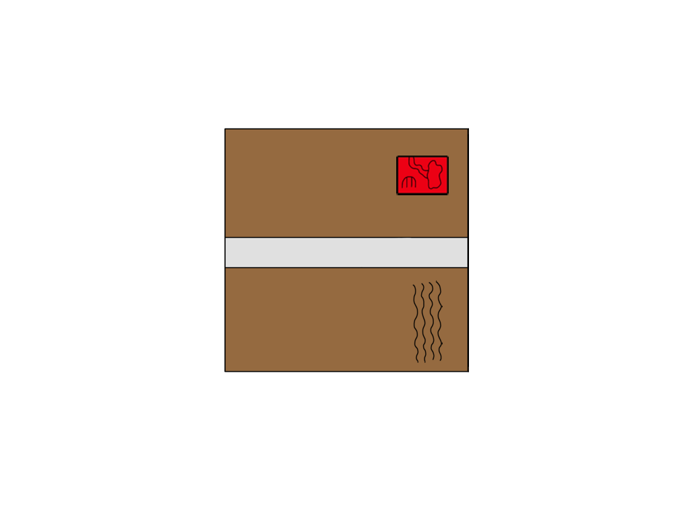
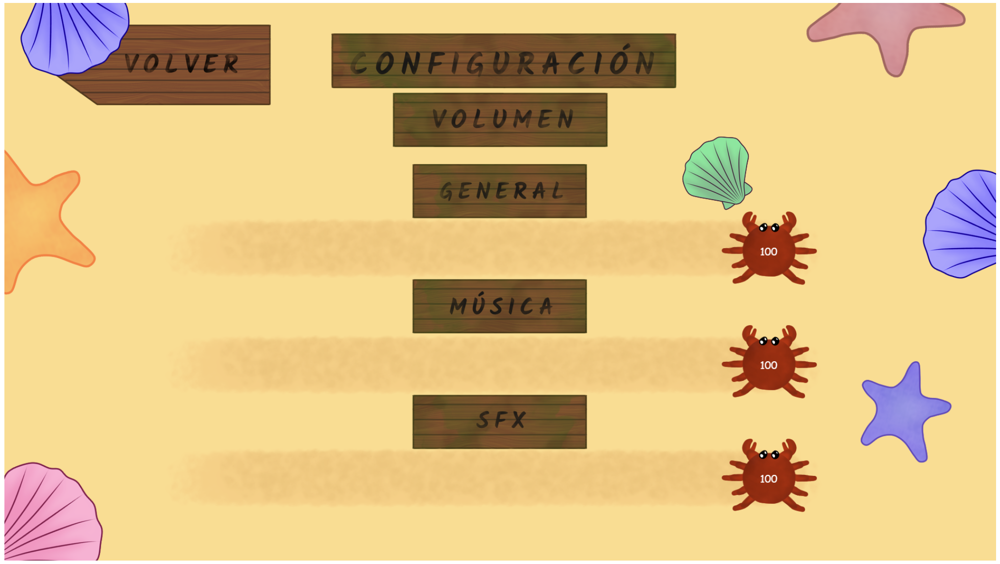

# Información del juego

## Video presentación Youtube
<a href="https://youtu.be/81VdnVg57F0?si=fAtOaWXOVZD9q7cv">Video de presentación de Crab Mail</a>
## Nombre del juego
Crab Mail

## Descripción de la temática del juego 
Crab Mail es un divertido juego cooperativo en el que los jugadores controlan a dos cangrejos que trabajan en una oficina de correos en medio de una playa. Estos deberán preparar sobres y paquetes, pasando por distintos procesos en un tiempo determinado con cuidado de no equivocarse y hacerlo lo más rápido posible.

## Integrantes
- Diego Martínez García. Correo: d.martinezg.2021@alumnos.urjc.es Cuenta de Github: DiegoMartinezGa
- Mario González Mallenco. Correo: m.gonzalezm.2021@alumnos.urjc.es Cuenta de Github: MarioGonzalezM
- Lenin Anderson Carrasco Romero. Correo: la.carrasco.2021@alumnos.urjc.es Cuenta de Github: leniin23
- Alejandro García Martínez. Correo: a.garciamart.2021@alumnos.urjc.es Cuenta de Github: AlejandroGarciaMartinez

# GDD CRAB MAIL

## Juego creado por
- Diego Martínez García
- Mario González Mallenco
- Lenin Anderson Carrasco Romero
- Alejandro García Martínez

## Índice
1. Cambios
2. Introducción
   - 2.1 Concepto
   - 2.2 Género
   - 2.3 Inspiración y referencias
   - 2.4 Propósito y público objetivo
   - 2.5 Historia del juego
   - 2.6 Plataformas
   - 2.7 Jugabilidad
   - 2.8 Estilo visual
   - 2.9 Alcance
3. Mecánicas
   - 3.1 Jugabilidad
   - 3.2 Flujo de juego
   - 3.3 Personajes
   - 3.4 Objetos
   - 3.5 Movimiento e interacción
4. Interfaz
5. Arte y música
   - 5.1 Máquinas
   - 5.2 Objetos
   - 5.3 Cartas y paquetes
   - 5.4 Interfaces
   - 5.5 Personajes
   - 5.6 Música
6. Integración de API REST
   - 6.1 Sistema de usuarios
   - 6.2 Chat
   - 6.3 Instrucciones de ejecución
7. Uso de Websockets
   - 7.1 Sistema de rooms
   - 7.2 Actualización del juego
8.  Mejoras adicionales
   - 8.1 Tutorial
   - 8.2 Persistencia
   - 8.3 Otras mejoras
   - 8.4 Arreglo de errores
   - 8.5 Insignias
   - 8.6 Posibles mejoras

## 1. Cambios
### Versión 1 
Primera versión del GDD creada. Se han creado distintas secciones para comprender distintos apartados del mismo, así como una descripción general de este junto con su público objetivo y estilo visual, un apartado para las mecánicas del juego y sus controles. Por último, se ha creado un apartado de arte 2D donde están incluidos distintos assets que se han creado para el juego.

### Versión 2
Se ha añadido todo lo relacionado con la creación del juego una vez desarrollado, como sprites, descripción de la música creada, menús... así como algunos aspectos que no se introdujeron en la primera versión del GDD como la historia del juego, las plataformas para las que está desarrollado, inspiraciones y el flujograma del juego. Por último, se han modificado algunos de los sprites de la primera versión para introducir su versión definitiva.

### Versión 3 
Se ha añadido al GDD la descripcion completa de como se han implementado el sistema de usuarios y el chat haciendo uso de una API Rest. También se ha añadido las interfaces relacionadas a estas 2 funcionalidades y se han actualizado el resto de interfaces afectadas. Por último se ha añadido el diagrama UML relacionado con las clases usadas para la API Rest

### Versión 4
Añadido todo lo relacionado a la implementación de websockets en el juego, para permitir el modo multijugador en línea mediante el uso de los mismos y mandando información a un servidor. También se han añadido todas las mejoras implementadas en la fase 5, así como la viabilidad de ciertas mejoras que no se han podido incluir por falta de tiempo. 

## 2. Introducción
### 2.1 Concepto
Crab Mail es un divertido juego cooperativo en el que los jugadores controlan a dos cangrejos que trabajan en una oficina de correos en medio de una playa. Estos deberán preparar sobres y paquetes, pasando por distintos procesos en un tiempo determinado con cuidado de no equivocarse y hacerlo lo más rápido posible.

### 2.2 Género
Este juego combina dos géneros distintos. Estos son:
  - Lógica: Los juegos de este tipo requieren agilidad mental por parte del jugador para realizar tareas o resolver enigmas. En Crab Mail, los jugadores deberán trazar planes para conseguir enviar el mayor número de paquetes en el tiempo dado, sin entorpecerse el uno al otro en el camino. El factor cooperativo complica más el asunto, llevando a los jugadores a organizarse y dividirse las tareas para optimizar el tiempo lo máximo posible.
    
  - Acción: En este tipo de juego, el jugador debe usar velocidad, destreza y tiempo de reacción. En Crab Mail, los jugadores tendrán que ser rápidos para lograr entregar las comandas antes de que expiren. Además, tendrán que adaptarse a los posibles cambios que ocurran en la partida de forma veloz.

### 2.3 Inspiración y referencias
El juego está inspirado en otros juegos cooperativos, como la saga Overcooked, donde los jugadores deben cooperar para preparar platos de comida; y Keywe, un juego basado en preparar pedidos.

Para la estructura del GDD se ha tomado como referencia el GDD de Sion Tower (https://github.com/dsaltares/sion-tower/blob/master/doc/gdd/gdd.pdf).

### 2.4 Propósito y público objetivo
Crab Mail es un juego diseñado para entretener a los jugadores. Si bien en un principio puede resultar una experiencia caótica por el ritmo de las partidas y el desconocimiento de algunas mecánicas, los jugadores se acabarán ayudando para lograr todos los objetivos, por lo que al final se acaba fomentando la cooperación.

El juego no está dirigido a ninguna sección del público en específico, pueden jugarlo personas de todas las edades. Gracias a que el juego consiste en partidas rápidas y controles muy sencillos, no es necesario disponer de una gran cantidad de tiempo para jugarlo ni de tener mucha habilidad.

### 2.5 Historia del juego
Carb Mail es un juego que no tiene una fuerte componente narrativa, ya que su gameplay se basa en rondas independientes que no tienen ninguna relación entre sí y no cuentan una historia.

Sin embargo se ha creado un pequeño trasfondo para el juego que se tiene pensado incluir en el juego en forma de introducción o cinemática.

La historia del juego comienza con un accidente de un avión en una playa de una isla desierta. Este avión contenía máquinas y articulos de ofimática, que fueron a parar a la costa. Con el paso del tiempo, los cangrejos que habitaban la playa aprendieron a usarlos y los utilizaron para crear una oficina en la que poder crear y enviar cartas y paquetes a distintos sitios del mundo. Por ello, en este juego se controlan a dos empleados de la oficina, que tienen que completar el mayor número de pedidos posibles en lo que dura su turno si no quieren ser despedidos.

### 2.6 Plataformas
El juego está siendo desarrollado para PC, pudiéndose jugar en un navegador web con teclado. Sin embargo, se está estudianto la posibilidad de incluir compatibilidad con mando.

### 2.7 Jugabilidad
El juego se basa en rondas rápidas, donde los jugadores tienen que tratar de completar el mayor número de envíos posibles en el tiempo dado. Los elementos principales de las rondas son:

  - Movilidad: Los jugadores pueden moverse por la oficina, con cuidado de no chocarse entre ellos, para llegar a los distintos puntos donde se realizan las tareas.

  - Máquinas: Son los lugares donde los jugadores realizan las tareas para poder enviar paquetes y sellos. Están repartidas por el área de juego y solo pueden ser usadas por un jugador a la vez. Algunos ejemplos son el ordenador o la impresora.

### 2.8 Estilo visual
El estilo del juego es en 2D, con el uso de sprites con colores vivos que encajan a la perfección con la estética animada del juego. Cabe destacar que será un estilo visual simple, sin gran cantidad de detalles, como por ejemplo, sombreados leves.

### 2.9 Alcance
Al ser un juego que consiste en rondas cortas, se pueden ampliar la cantidad de mapas jugables, con diferentes disposiciones de las máquinas en ellos. Además, se pretende ampliar los distintos objetos que salen de la cinta, para dar mas variedad al juego.

## 3. Mecánicas
Las mecánicas del juego son muy sencillas, incluyendo teclas para el movimiento de los personajes y un par de botones para interactuar con los diversos objetos.

### 3.1 Jugabilidad
El juego consiste en partidas cronometradas donde los jugadores tienen que completar el mayor número de tareas en el tiempo dado. Cada tarea tiene a su vez un límite de tiempo para poder ser realizada, antes de que el cliente la cancele y los jugadores pierdan puntos.

Podemos encontrar 2 tipos de pedidos: paquetes y cartas. Cada uno de ellos deben pasar por una serie de máquinas y procesos antes de ser depositados en los buzones de envío. 

Una vez entregado el pedido, se otorgará una puntuación que depende de si se ha seguido el proceso correcto a la hora de preparar los pedidos o ha faltado algún paso.

Al final de la partida, se obtiene una puntuación total para los dos jugadores según la cantidad de pedidos preparados.

### 3.2 Flujo de juego
El flujo del juego es el siguiente:

Al empezar la partida, comienzan a aparecer distintos objetos en la cinta de transporte. Estos pueden ser de dos tipos:

  - Papel: Indica que hay que preparar una carta.
  - Objeto: Indica que hay que preparar un paquete con ese objeto.

Una vez se hayan preparado los pedidos, se deben llevar a su buzón correspondiente antes de que se acabe el plazo para obtener puntuación positiva.

Cada pedido tiene su método de preparación distinto, es decir, antes de ser enviado, debe pasar por máquinas distintas.

En el caso de las cartas, primero se debe llevar el papel a la impresora para rellenar la informacion, luego meterlo en un sobre, introducir su dirección con el ordenador, y añadirle el sello correspondiente a las cartas. Por último se debe introducir en el buzón de las cartas.

Para preparar los paquetes, primero se debe coger el objeto de la cinta transportadora, llevarlo a la estación de empaquetado, meter su dirección en el ordenador, pesar el paquete en la báscula y poner un sello de acuerdo a su peso. Para completar el envío, se debe introducir el paquete en el buzón de paquetes.

### 3.3 Personajes
Los jugadores controlarán a un cangrejo que tendrá un aspecto por defecto, siendo el jugador uno un cangrejo de color rojo, y el jugador dos uno más anaranjado, con el objetivo de que los jugadores puedan diferenciarlos durante el juego.

Se baraja la opción de incluir un sistema de personalización para los cangrejos, donde se les pueda cambiar aspectos como el color o añadir elementos cosméticos.

### 3.4 Objetos
En el juego, los objetos que se pueden encontrar coinciden con las principales mecánicas del juego, las máquinas que se deben usar para preparar los pedidos a entregar. Además, algunos objetos tienen varios sprites que se activan dependiendo de en que estado se encuentre la máquina, como por ejemplo la impresora, que en un principio aparece vacía y cuando acaba de imprimir, muestra un sprite con el papel.

  - Impresora: Sirve para rellenar las cartas. Una vez que se interactúa con ella, se activa un pequeño temporizador. Al terminar esta cuenta atrás, la carta sale de la impresora rellena. Hay que volver a interactuar con la impresora para recogerla.

  - Caja de sobres: Los jugadores interactúan con esta caja para meter el papel impreso en el sobre.

  - Ordenador: Los jugadores interactúan con una carta o paquete para añadir la dirección. Es necesario que el pedido se encuentre en un sobre o un paquete para poder usarla.

  - Estación de empaquetado: En esta máquina, los jugadores pueden introducir los objetos para que sean empaquetados. Tiene un pequeño temporizador que acaba cuando el objeto sale empaquetado de la máquina.

  - Báscula: El jugador debe interactuar con la báscula con un paquete en mano, con el objetivo de pesarlo y saber qué sello debe colocarle a continuación. En la primera interacción se coloca el objeto en la báscula y aparece el peso en una pequeña pantalla a la derecha, y en la segunda interacción se recoge el objeto de nuevo. Esta máquina se puede usar tanto si el objeto ha sido empaquetado como si no lo está aún.

  - Mesa de sellos: En esta mesa los jugadores deben poner un sello a los sobres y a los paquetes. En total hay cuatro sellos: sellos para las cartas, sellos para paquetes con un peso menor a 5 kg, entre 5 y 10 kg y más de 10 kg.

  - Estación de reciclado: En este lugar, los jugadores pueden devolver el pedido a su estado original en caso de equivocación en alguna parte del proceso. En el caso de las cartas, devuelve el papel sin imprimir; y en el caso de los paquetes, devuelve el objeto desempaquetado.

  - Buzones de envío: En este lugar hay dos buzones, uno para las cartas y otro para los paquetes. Aquí es donde los jugadores deben llevar los pedidos una vez hayan acabado de prepararlos para obtener puntos. A la hora de usarlos, hay que interactuar dos veces: la primera vez abre el buzón, y la segunda envía el objeto.

  - Papelera: Los jugadores podrán tirar los pedidos aquí en caso de que no consigan preparar el pedido a tiempo.

  - Cinta: En esta máquina aparecen todas los objetos y cartas que los jugadores pueden coger para preparar los pedidos. Pueden salir tanto objetos de diferentes tamaños y pesos, como papel para las cartas.

  - Mesas: Se han colocado mesas a lo largo y ancho de todo el mapa. Estas tienen 2 objetivos: servir como límites del escenario del juego y crear un entramado gracias a las mesas centrales. Estas mesas crean un espacio que contiene tanto el ordenador como la báscula y, al no ser un espacio muy amplio, puede provocar choques entre los jugadores, aumentando el caos en la partida.
    
### 3.5 Movimiento e interacción
El movimiento de los cangrejos no es el movimiento tradicional en cuatro direcciones, sino que el cangrejo solo podrá avanzar hacia delante y hacia detrás. Para cambiar la dirección, el jugador tendrá que rotar el cangrejo a la izquierda o a la derecha. 

Además, hay un botón para interactuar con los diferentes objetos y poder completar las tareas. Cuando un jugador interactúa con un objeto, el cangrejo lo coge y de este modo puede llevarlo a donde necesite, ya sea un objeto que se necesite meter en un paquete o un papel que se tenga que llevar a la impresora. Además, para llevar un objeto de una máquina a otra el jugador puede interactuar con este y coger el objeto para llevarlo a donde necesite.

De este modo, el movimiento del jugador 1 será W para avanzar, S para ir hacia atrás, A para rotar a la izquierda y D para rotar a la derecha. El jugador 2, en cambio, usará la flecha hacia arriba para avanzar, la flecha hacia abajo para retroceder, y las flechas hacia izquierda y derecha para rotar. El botón de interacción para el jugador 1 será la E, y para el jugador 2 la tecla O.

Además, las máquinas solo pueden ser utilizadas por un jugador a la vez y las máquinas que tienen un temporizador como la impresora y la estación de empaquetado no se pueden utilizar si están funcionando.

## 4. Interfaz
Debido al amplio rango de edades, las interfaces serán sencillas. Para ampliar la inmersión, estas estarán extensivamente tematizadas. 

Sin embargo, al ser un juego sencillo, solo va a precisar de las siguientes interfaces:

  - Menú principal: Contiene la pantalla de título y las opciones de comenzar una partida local o una partida en red. También permite acceder al menú de opciones y al menú de controles. La opción de partida local hace que el juego comience.
   
  - Menú de pausa: Tiene las opciones de continuar el juego y acceder al menú de ajustes. 

  - Menú de ajustes: Permite configurar ciertos parámetros, como el volumen de la música o de los efectos de sonido. Se puede salir al menú anterior.
    
  - Menú de juego online: Debido a que todavía no se ha implementado el juego online, esta pantalla muestra un cartel de "en construcción".

  - Menú de fin de partida: Una vez que se ha terminado la partida se accede a esta pantalla donde se muestra la puntuación que se ha obtenido en la partida, así como dar la opción de volver al menú principal para comenzar otra partida e intentar lograr una mejor puntuación.

Por último, se ha creado un flujograma que muestra el flujo de las distintas pantallas que se muestran en el juego.

## 5. Arte y música
En cuanto al arte del juego, todo es de elaboración propia, usando programas como Photoshop y Krita. Además, también se ha creado la música que aparece en el menú del juego y en las partidas usando un programa de creación de música. 

### 5.1 Máquinas
Aquí se puede ver el arte de todas las máquinas que se pueden encontrar en el escenario de juego y con las cuales el jugador debe interactuar.

Impresora: 

Báscula: 

Buzón de cartas: 

Buzón de paquetes: 

Caja de sobres:

Ordenador: 

Mesa de sellos: 

Estación de empaquetado:

Cinta:

Papelera:

Estación de reciclado:

Mesa:

Mesa central:

### 5.2 Objetos
Se han diseñado distintos objetos que aparecen en la cinta, como una consola, un juego o un peluche. Además de los papeles que indican al jugador que debe preparar una carta.

Consola:

Videojuego:

Mancuerna:

Peluche:

Yunque:

Papel:

### 5.3 Cartas y paquetes
También se han creado distintos sprites que representan el estado de la carta y el paquete llevado por el jugador. Por ello, encontramos un sprite de la carta/paquete sin nada, la carta/paquete con el sello o la dirección y la carta/paquete con ambas cosas.

Carta sin nada:

Carta con sello:

Carta con dirección:

Carta con sello y dirección:

Paquete sin nada:

Paquete con sello:

Paquete con dirección:

Paquete con sello y dirección:

### 5.4 Interfaces
Menú principal: 

Menú de pausa: 

Fondo de juego: 

Menú final:

Menú de configuración:

Menú "en construcción":

### 5.5 Personajes
Para los personajes, se han creado spritesheets para la implementación de las animaciones de los personajes caminando.

Sprites del jugador 1: 

Sprites del jugador 2: 

### 5.6 Música
Debido al ambiente alegre del juego, se ha creado una música alegre que evoque el verano. Pero, al tratarse de un juego con un componente de presión, la música tiene un ritmo que provoca un poco de tensión en los jugadores. 

Además, la música de fondo tiene dos versiones, una para los 2 primeros minutos de la partida, y otra para el último minuto, la cual es una versión acelerada de la música del fondo creada para provocar una mayor tensión en los jugadores y aumentar el factor de caos.  También se ha introducido música de fondo en el menú principal, así como sonidos cuando pulsas los botones del menú.

Para crear la musica, se ha utilizado Musescore 4. En él, se han usado instrumentos como el piano y la flauta acompañados de percusión para dar ritmo a la canción. Para la versión rápida de la música que se usa en las partidas, se ha añadido un bombo para dar más presión y provocar una sensacion de caos en los ultimos momentos de la partida.

También se han incluido sonidos que se reproducen al interactuar con las distintas máquinas del juego, como la impresora, la estación de empaquetado o el ordenador;y también cuando completas un pedido.
Si bien la música ha sido creada por nosotros, los sonidos de las máquinas y de los menús se han obtenido de una librería de sonidos en internet.  (https://pixabay.com/es/)

## 6. Integración de API REST
Se ha hecho uso de una API Rest y de llamadas a la misma para crear dos funcionalidades que usan un servidor. Estas son un sistema de usuarios, que incluye el login, registro y más características; y un sistema de chat en el que los usuarios pueden comunicarse entre sí y donde estos pueden ver los usuarios que hay registrados en la página.

### 6.1 Sistema de usuarios
Se ha creado un sistema que permite a los jugadores crearse una cuenta gracias a un nombre de usuario y a una contraseña a su elección. También puede utilizarse para que sean identificados en el chat, donde aparecerá su nombre si están logeados.

Este sistema de usuarios también permite a los mismos manejar distintos aspectos de su cuenta, como actualizar su contraseña e incluso borrar la cuenta.

Para implementarlo se ha utilizado una clase LoginRequest, que almacena el nombre de usuario y la contraseña, una clase UserService de tipo @Service que se encarga de la autenticación en el login y el registro de usuarios; y por último, una clase UserController de tipo @Controller que se encarga de la lógica del login y registro y de las funciones de actualizar la contraseña y borrar la cuenta.

De este modo, para la creación de este sistema se han utilizado los siguientes metodos de API Rest:
- POST: Manda información al servidor en el login y el registro de usuarios. Permite al usuario iniciar sesión si ya tiene una cuenta creada o registrarse en caso de no tener ninguna.
- PUT: Se utiliza para cambiar en el servidor la contraseña del usuario si este lo desea.
- DELETE: Se utiliza para eliminar la cuenta del servidor.

A continuación se muestran las respectivas pantallas del sistema de usuarios, así como las variaciones en el menú principal.

  
  
  

  

  

### 6.2 Chat
También se ha creado un sistema de chat que permite a los usuarios que se encuentren conectados al servidor comunicarse entre sí. En este chat, cada vez que se entra a él, aparecen todos los mensajes anteriores, 
para que el jugador pueda ver toda la conversación hasta el momento.

Además, al lado de cada mensaje aparece el nombre del usuario que lo ha mandado. Si el usuario ha iniciado sesión en el juego, aparecerá su nombre de usuario, lo que permitirá a los demás usuarios saber quién es.
En cambio, si el usuario no ha iniciado sesión, en vez de su nombre pondrá "Anónimo".

Para implementar el chat se ha utilizado una única clase de tipo @Controller llamada ChatController que se encarga de gestionar tanto el envío de mensajes, como de devolver todos los mensajes enviados anteriormente, para que el jugador pueda ver todos los mensajes en el chat.

Para ello se han usado los siguientes métodos:
- GET: Permite obtener todos los mensajes escritos anteriormente en el chat.
- POST: Mandar un mensaje al chat para que puedan verlo el resto de usuarios.

A continuación, se adjunta una imagen del chat del juego.

### 6.3 Diagrama UML

A continuación se adjunta un diagrama UML de las clases usadas en la implementación de la API REST. El diagrama se ha creado usando IntelliJ.

### 6.4 Instrucciones de ejecución

Para iniciar el juego, hay que abrir Spring Tool Suite e importar el proyecto. Una vez importado, ejecutarlo como un java application. Después, en el navegador, conectarse a la IP y al puerto correspondiente, y ya se pueden utilizar todas las funciones del juego con normalidad.

## 7. Uso de websockets
Se ha implementado el uso de websockets para permitir el juego multijugador de los jugadores que se encuentren en la misma red local. Para ello, se ha implementado tanto un sistema de habitaciones (rooms) que empareja a los jugadores de 2 en 2, como el envío de datos al servidor mediante el uso de websockets para actualizar el estado del juego para ambos jugadores.

### 7.1 Sistema de rooms

Para acceder al juego en línea, los jugadores deben ir al menú de online y pulsar el botón de "Preparados". En el momento en el que dos jugadores lo han pulsado, el servidor les asigna una room para ellos y comienza la partida, además de otras características como su propio temporizador de partida. De esta forma, aunque otro jugador intente acceder a la partida online, se quedará esperando a un cuarto jugador y no podrá interferir en las partidas en curso. Este sistema se ha implementado porque es un juego creado para ser jugado por dos jugadores, por lo que se debe limitar el acceso a más jugadores. 

Además, se ha implementado un sistema de detección de actividad, de forma que si un jugador se sale de la partida o está inactivo durante un tiempo determinado, la partida termine y se avance a la pantalla de fin del juego directamente. Gracias a esto, si un jugador abandona la partida o se le cae la conexión, el otro jugador no tiene que esperar a que el temporizador termine o reiniciar la página; sino que será notificado de que el otro jugador se ha ido y podrá volver al menú principal, para iniciar otra partida.

### 7.2 Actualización del juego

En las partidas, el uso de websockets ha sido una parte esencial para permitir la implementación de las partidas online. Al ser un juego cooperativo, el jugador necesita saber en todo momento que está haciendo su compañero para poder tomar decisiones en base a esto. Esto implica que el jugador debe conocer la posición y rotación de su compañero, que objetos lleva... Por lo tanto, necesitamos usar websockets para comunicar los datos al servidor y que este se encargue de comunicarlo al otro jugador.

Para ello, en cada actualización del juego, el jugador 1 envía al servidor varios datos como su posición en x e y, su rotación, el objeto que transporta y un timer para sincronizar las partidas, en formato JSON. Despúes, el jugador 2 recibe esos datos haciendo una llamada GET y sustituye los datos del jugador 1 en su partida, de forma que todos los datos del jugador 1 aparecen actualizados en su partida en todo momento mientras juega.

También se envían datos al servidor cuando aparece un nuevo objeto en la cinta transportadora, de forma que ambos jugadores tengan los mismos objetos en pantalla y no se puedan producir confusiones. También se  envían datos cuando un jugador interactúa con alguna de las máquinas.

De esta forma, en una misma actualización, un jugador manda su información al servidor para mandársela al otro jugador, y recibe la información del otro y la actualiza. Gracias al uso de websockets se ha conseguido que los 2 jugadores estén sincronizados en todo momento y lo más importante, que puedan ver en todo momento por pantalla todo lo relacionado a su compañero, para que sepan sin ningún tipo de dificultad dónde se encuentra y qué está haciendo, favoreciendo la cooperación entre ellos.

## 8. Mejoras adicionales

Una vez terminado el juego, se ha procedido a realizar una serie de mejoras adicionales para la realización de la fase 5 de la práctica. Entre estas mejoras se pueden encontrar cambios que mejoran la jugabilidad y ayudan al entendimiento del juego, como por ejemplo un tutorial completo del juego y la adición de persistencia en el juego. También se ha añadido un nuevo objeto y se ha añadido un secreto al menú al teclear la palabra 'CRAB'. 

### 8.1 Tutorial

La mejora más grande es, sin duda, la creación de un tutorial que los jugadores pueden jugar para entender las mecánicas del juego. Para acceder al tutorial basta con pulsar a la gaviota que se ha añadido en el menú principal. El tutorial está dividido en 2 partes: un tutorial para la preparación de las cartas y otro tutorial para la preparación de los paquetes. En estos tutoriales, la gaviota Otto explica mediante una serie de diálogos los pasos que los jugadores tienen que seguir para preparar los pedidos. Una vez acabado el tutorial de las cartas se pasa al de los paquetes, y una vez terminado este, se pasa al menú principal de nuevo para que los jugadores puedan jugar una partida real.

En estos tutoriales se han eliminado las máquinas que sean irrelevantes para el tutorial, como la estación de reinicio y la papelera, y se han ocultado las máquinas que no corresponden a ese tipo de pedido, como por ejemplo, la báscula en el tutorial de las cartas o la impresora en el tutorial de los paquetes.

### 8.2 Persistencia 

Uno de los errores que había en la fase 3 era la falta de persistencia tanto a la hora de usar el chat como a la hora de crear usuarios. Se ha añadido persistencia al juego, de forma que se guarde en un archivo txt tanto los usuarios que se han registrado en el juego, como todos los mensajes que se han enviado en el chat. De esta forma, cuando el jugador entra en el juego, puede utilizar el usuario que haya creado anteriormente, así como ver los mensajes anteriores a su llegada en el chat.

### 8.3 Otras mejoras 

Se ha añadido al juego un asset más que se utiliza en los paquetes, una camiseta de un equipo deportivo que aparecerá en la cinta, como el resto de objetos del juego. También se ha añadido un combo en el menú principal que se activa al introducir la palabra 'CRAB' en el menú. También se ha mejorado el rendimiento del juego gracias a la sustitución de algunos assets por algunos de menor resolución para disminuir el peso del juego y disminuir tiempos de carga, un error que se pudo apreciar en la presentación de la fase 2.

### 8.4 Arreglo de errores

En esta fase, anterior a la publicación del juego en Internet, se ha realizado un testeo intensivo del juego para encontrar y pulir la mayor cantidad de errores posibles antes de publicarlo. Gracias a estas pruebas, se han encontrado y solucionado cierta cantidad de errores presentes en el juego como:

- Los cangrejos pueden empujarse fuera del área de juego atravesando las paredes.
- Si un cangrejo choca con otro en una máquina, puede atravesarla.
- El menú de pausa no aparecía en ciertas ocasiones.
- Solapamiento de música al navegar entre los menús.
- Si el jugador pulsaba muy rápidamente los botones de avanzar e interactuar, podía atravesar cualquier parte del escenario.

### 8.5 Insignias
Con esta fase, optamos a las siguientes insignias:

- We are the champions: Uno de los objetos que aparecen en la cinta es una camiseta que hace referencia al Real Betis Balompié.
- Ultimando los ajustes: En el juego existe la opción de modificar los parámetros de volumen general, música y SFX. A este menú se puede acceder desde el menú de pausa o desde el menú de Ajustes en el menú principal.
- Música original: Toda la música del juego es original y creada por nosotros, tanto la del menú principal como las dos versiones que suenan en partida.
- Memencanta: Si se introduce la combinación secreta 'CRAB' en el menú principal del juego, aparecerá una imagen secreta a modo de meme sobre el propio juego.
- Al más pelota: En uno de los diálogos la gaviota Otto hace referencia al profesor de la asignatura haciendo un halago.

### 8.6 Posibles mejoras
Aparte de las mejoras ya incluidas, se han planificado una serie de mejoras que pueden ser incluidas en el juego sin muchas complicaciones, pero que lamentablemente, por falta de tiempo, no han podido ser implementadas.

Por un lado encontramos un sistema de personalización de los cangrejos, donde personalizar por completo la apariencia de estos, como el color o cosméticos. También es viable incluir conjuntos de trajes inspirados en películas, series y juegos populares.

Por otro lado, también se ha ideado un sistema de obstáculos que dificulte la tarea de los jugadores, como unas latas que caigan en el escenario y bloqueen ciertas partes del mismo, o un animal que se pasee por el escenario siendo un bloqueo dinámico.

También existe la opción de crear una gran cantidad de objetos que puedan salir de la cinta, dando así una gran variedad al juego; y cambiar la fuente de algunos de los textos del juego, para que concuerden mejor con el resto del juego.

Además, existe la opción de incluir nuevas máquinas que afecten a la jugabilidad y lo hagan más dinámico. Un ejemplo podría ser la incineradora, que se puede usar para tirar paquetes peligrosos que puedan llegar a la oficina. La inclusión de nuevas máquinas modificaría el flujo del juego y el sistema de puntuación, entre otros.

Por último, se ha barajado la posibilidad de incluir distintos mapas, cada uno con su propia distribución de las máquinas y obstáculos propios como ajugeros o piedras, en función de su dificultad. Esto aportaría al juego el factor de rejugabilidad sin que se haga repetitivo, pues las partidas no serían tan similares entre sí.

  

